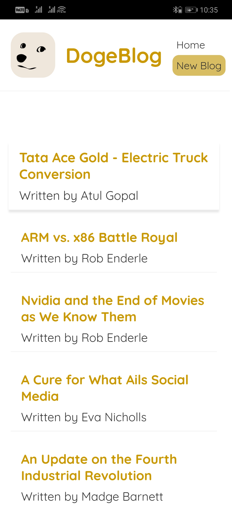
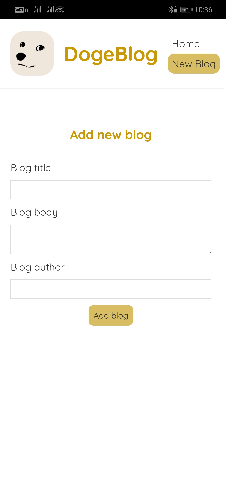
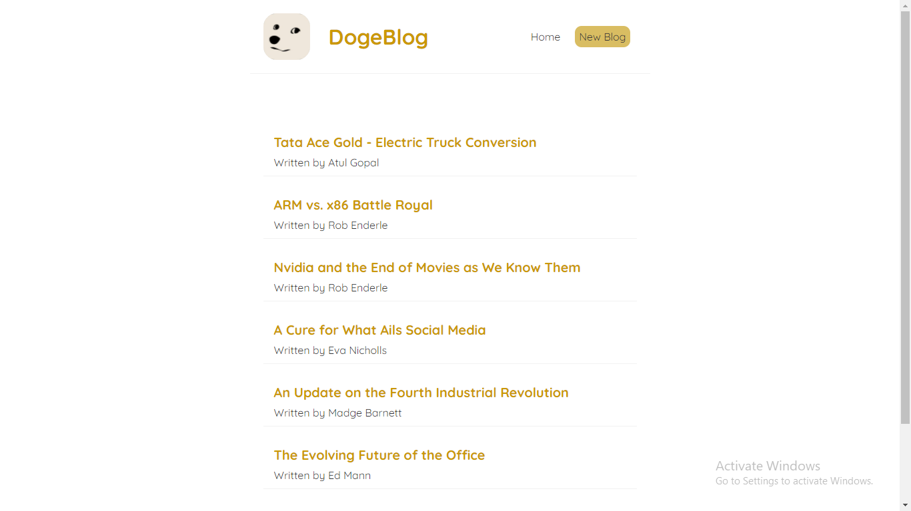

# DogeBlog
:link: https://doge-blog.netlify.app/  
It is a blog website created using React. Where you can perform create, read and delete operations.\
<b>JSON Server</b> is use to store data related to blog.

## Setting up JSON Server
### `json-server --watch data/db.json --port 8000`
data/db.json(data) will be watched in json-server.\
local server will be create at http://localhost:8000 . By default it start in port 3000.

## Available Scripts

In the project directory, you can run:

### `npm start`

Runs the app in the development mode.\
Open [http://localhost:3000](http://localhost:3000) to view it in the browser.

The page will reload if you make edits.\
You will also see any lint errors in the console.

### `npm run build`

Builds the app for production to the `build` folder.\
It correctly bundles React in production mode and optimizes the build for the best performance.\
The build is minified and the filenames include the hashes.

    
    

